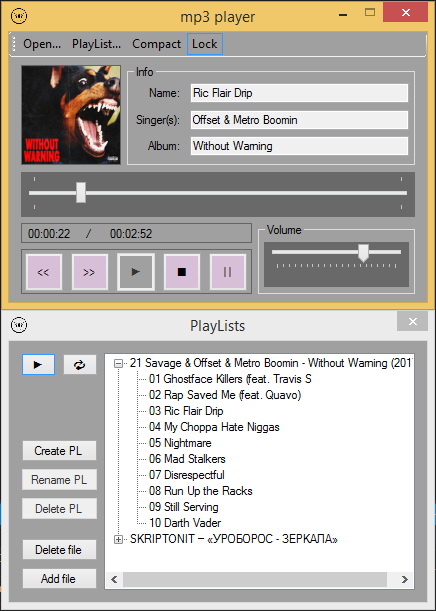
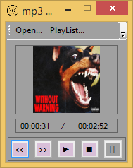

# MP3Player
Music player audio files expansion .mp3. Implemented in C # with WindowsForms. Implemented in the MVP architecture. It is possible to view information about the track, cover, you can rewind playback. It is also possible to create playlists and customize the playback of tracks in playlists.

